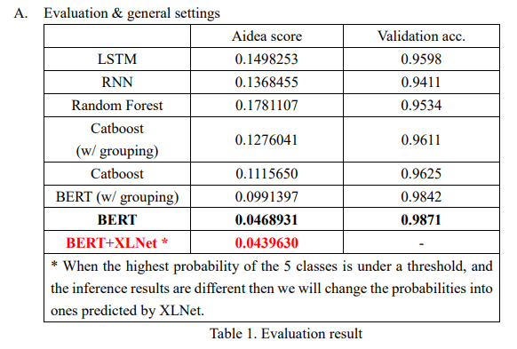
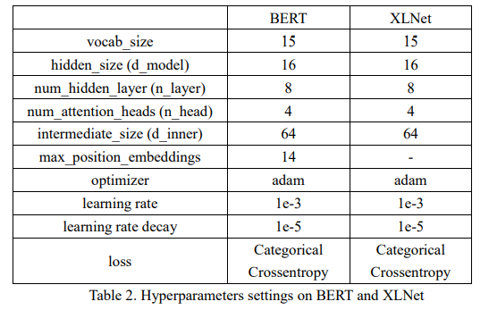
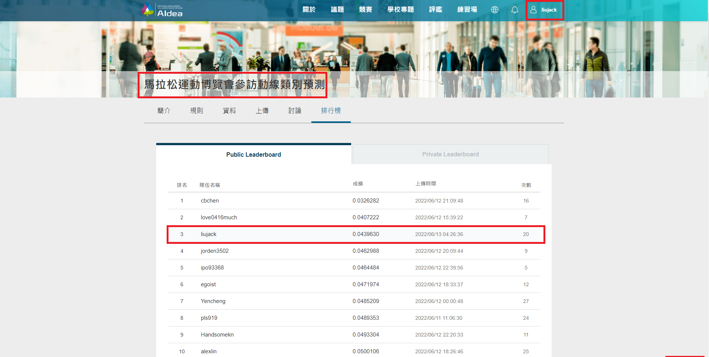

# Behavior-Classification-of-Exposition-Visitors
馬拉松運動博覽會參訪動線類別預測 (Behavior Classification of Exposition Visitors)
* The goal of project is to predict the best route among five routing options.
* Team member: [Jack Liu](https://github.com/Jack24658735), [Barron Chang](https://github.com/BarronChang0302), [Michael Chung](https://github.com/KNKNN), [Leo](https://github.com/LeoTheBestCoder)

## Data
Dataset consists of `sniffer_loc`, `created_time`. We focus on using the information about `sniffer_loc`.

## Model Architecture
1. RandomForest
    * Ensemble of multiple decision trees (tree-based)
3. LSTM/RNN
    * Traditional sequence prediction method
4. CatBoost
    * Gradient boosting tree-based method
5. Transformer-based (BERT & XLNet)
    * With the help of **Multi-head self attention** mechanism

***Note: Under our attempts, we found that transformer-based models have better result and may have higher potential***

## Ablation Test & parameters setting

  

  

## Final Rank 
* **Our team reaches the top-3 on this leader board.**
* The statistics on Aidea platform by **2022.6.13**

  

## Others
Other details and discussion are stored in the .pdf file. Please find reference there if you're interested.
* Reference/note.md: the report.pdf and poster.pdf can help you understand more details.
* src/note.md: Summarize how our code works and the purposes of each files. 

